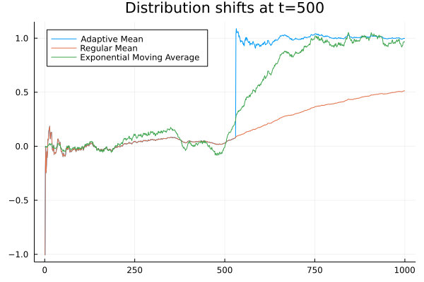

# AdaptiveWindows.jl
Adaptive window implementation (ADWIN2: Bifet &amp; Gavalda) 

*Bifet, Albert & Gavaldà, Ricard. (2007). Learning from Time-Changing Data with Adaptive Windowing. Proceedings of the 7th SIAM International Conference on Data Mining. 7. 10.1137/1.9781611972771.42.*

Abstract (abbreviated)

> We present a new approach for dealing with distribution
> change and concept drift when learning from data sequences
> that may vary with time. We use sliding windows whose
> size, instead of being fixed a priori, is recomputed online
> according to the rate of change observed from the data in
> the window itself: The window will grow automatically when
> the data is stationary, for greater accuracy, and will shrink
> automatically when change is taking place, to discard stale
> data. This delivers the user or programmer from having to
> guess a time-scale for change.
> Contrary to many related works, we provide rigorous
> guarantees of performance, as bounds on the rates of false
> positives and false negatives. In fact, for some change structures, we can formally show that the 
> algorithm automatically adjusts the window to a statistically optimal length.


The adaptive windowing algorithm works by maintaining a set of buckets (the window) with Variance() objects in each of these. Each group of buckets has a maximum capacity for the number of observations it holds. A constant M is used to define the size of the group. In the package, M is hardcoded to be equal to 5, but M=3 will be used below.

The content of the window is exponentially increasing, with the first group of buckets containing at most 1 observation, the next group at most 2, then at most 4, etc.:

1 1 1 2 2 2 4 4 4 8 8 8 16 16 16 32 32 32 ...

The algorithm perform a statistical test using Hoeffding bounds on every splitpoint between these buckets, using the accumulated means and variances. If the front of the window is considered to have a statistically different mean than the back of the window, the observations at the back are removed, and 'drift' is detected. 

The adaptive window is driven by a tolerance parameter δ, the probability for a false positive (incorrectly identified drift).

# Example

```julia
using AdaptiveWindows

m = AdaptiveMean(δ = 0.001) 

fit!(m, randn(1_000))

println(nobs(m)) # we should see that the stats are computed over 1_000 data points

println("The mean: $(value(m)) should be close to 0.0")

# change the distribution
fit!(m, randn(1_000) .+ 1) 

# now the older observations should be dropped
println(nobs(m)) 

# mean should be close to 1.0 (not 0.5 if we did a mean over all 2_000 points)
println("The mean: $(value(m)) should be close to 1.0")

```
The package uses the interface from OnlineStatsBase. The 'nobs' measurement returns the number of observations underlying the current mean value. Values might have dropped out of the adaptive window, so nobs is not necessarily equal to the number of times fit! is called.

In the following example, the adaptive window should detect the shift in distribution about 50 observations after the 500th one. If you want the mean to be more sensitive increase the probability of detecting shift (delta). Note that this can lead more easily to false positives.

```julia
using AdaptiveWindows

m = AdaptiveMean(onshiftdetected = ad -> println("Shift detected!"))

fit!(m, vcat(randn(1000), randn(1000) .+ 1))

```

The graph below shows the computed means for the Adaptive mean, a regular arithmetic mean and an exponential moving average on the dataset generated above. The discontinuity in the Adaptive Mean occurs when the shift in the distribution is detected. Note that before the shift is detected, the adaptive mean is the same as the arithmetic, global, mean, while the exponential moving average differs.




